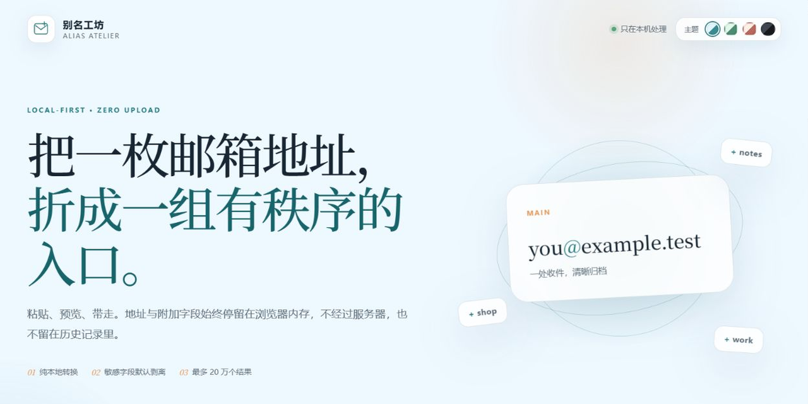

<div align="center">
  

  # 别名工坊 / Alias Atelier — 邮箱 +Tag 地址生成器

  **把一枚邮箱地址，折成一组有秩序的入口。**

  [](https://github.com/ferretgeek/AliasAtelier/actions/workflows/ci.yml)
  [](https://github.com/ferretgeek/AliasAtelier/actions/workflows/codeql.yml)
  [](LICENSE)
  [](#隐私设计)

  [English](README_EN.md) · [部署说明](docs/部署说明.md) · [技术与安全](docs/技术与安全.md) · [安全报告](SECURITY.md)
</div>

别名工坊是一款纯本地的邮箱 `+tag` 地址生成器。它能读取纯邮箱、`邮箱----附加字段` 和 Gmail 双行格式，在浏览器内完成识别、生成、遮挡预览与 TXT 导出。




## 它能做什么

- 自动识别 Gmail 与 Microsoft / Exchange Online 地址。
- 显式提供 iCloud 与任意域名的兼容性实验模式，不把未证实能力包装成承诺。
- 每个邮箱生成 1–50000 个标签地址，单次最多 200000 个，避免误操作拖垮浏览器。
- 可选择保留原邮箱、附加字段和单行/双行输出格式。
- 附加字段默认剥离；即使选择保留，页面预览仍只显示遮罩。
- 四套全局主题：天光、青瓷、暮霞与深灰，选择会留在当前浏览器。
- 无外部字体、统计脚本、接口请求或第三方运行依赖。

## 三分钟开始

需要 Python 3.10 或更高版本；运行时只使用标准库。

```bash
python scripts/serve.py
```

打开 `http://127.0.0.1:4173`。也可以直接打开 `index.html`，但本地服务器能提供更完整的安全响应头。

Docker 部署：

```bash
docker compose up -d --build
```

然后打开 `http://127.0.0.1:8080`。公网部署、反向代理和升级方式见[部署说明](docs/部署说明.md)。

## 支持边界

| 模式 | 工具行为 | 依据与边界 |
| --- | --- | --- |
| 自动识别 | 只处理 Gmail 与 Microsoft | 推荐默认值 |
| Gmail | 生成 `name+tag@gmail.example`（文档中的保留示例域名） | [Google 官方说明](https://support.google.com/a/users/answer/9282734)说明标签地址会进入当前收件箱 |
| Microsoft | 生成 Exchange Online Plus Addressing | [Microsoft 官方文档](https://learn.microsoft.com/exchange/recipients-in-exchange-online/plus-addressing-in-exchange-online)说明其默认开启，但组织管理员可以关闭 |
| iCloud | 仅在用户主动选择后生成候选地址 | Apple 官方介绍的是[已创建的 iCloud 别名](https://support.apple.com/guide/icloud/mm6b1a490a/icloud)与 [Hide My Email](https://support.apple.com/guide/icloud/create-and-edit-addresses-mm1a876f7aed/icloud)，没有承诺动态 `+tag`；必须先实测 |
| 任意域名 | 生成候选地址 | 是否投递完全取决于邮件服务商 |

它只生成收件地址，不会创建邮箱账号、登录邮箱、读取邮件或绕过网站规则。部分网站会拒绝含 `+` 的地址。

## 隐私设计

输入可能包含密码、应用密码、客户端标识或刷新令牌，因此项目按“输入就是秘密”设计：

1. 页面设置 `connect-src 'none'`，没有数据上传通道。
2. 用户内容不进入 `localStorage`、日志或 URL；只有主题名称会持久化。
3. 附加字段默认不进入结果，预览永远遮挡它们。
4. 下载文件由浏览器内存中的 `Blob` 创建。
5. `.gitignore` 默认忽略 TXT、私有目录、数据目录与导出目录，降低误提交风险。
6. 仓库示例均为从零创建的虚构内容，不含开发者的原始账号数据。

更详细的威胁模型、CSP 与发布门禁见[技术与安全](docs/技术与安全.md)。

## 验证

```bash
node --test tests/alias-core.test.js
python -m unittest discover -s tests -p "test_*.py" -v
python -m compileall -q scripts tests
```

CI 还会执行 Ruff、Bandit、pip-audit、detect-secrets、CodeQL 与预览资产校验。公开发布前另对工作树和完整 Git 历史运行 Gitleaks。

## 项目结构

```text
assets/             浏览器核心、交互与视觉样式
deploy/             Nginx 安全配置
docs/               部署、技术、安全审计与预览图
scripts/serve.py    依赖为零的本地静态服务器
tests/              Node 核心测试与 Python 服务器测试
index.html          应用入口
```

## 参与与许可

欢迎提交问题与改进，先阅读 [CONTRIBUTING.md](CONTRIBUTING.md)。安全问题请使用 GitHub Private Vulnerability Reporting，说明见 [SECURITY.md](SECURITY.md)。

项目以 [MIT License](LICENSE) 开源。
