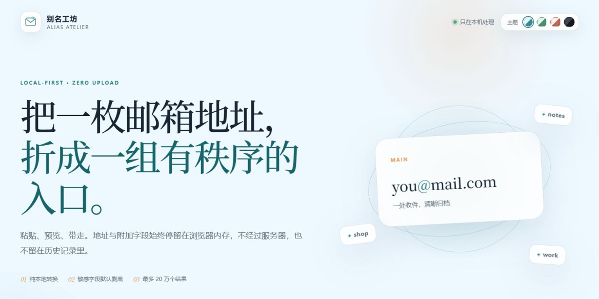
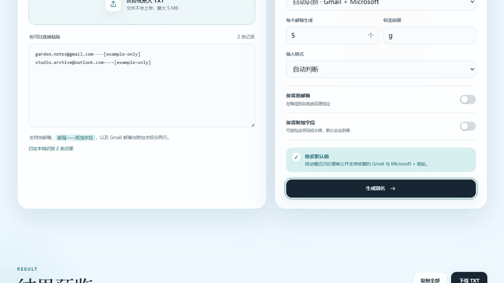

<div align="center">
  

  # Alias Atelier · 别名工坊

  **Fold one mailbox into an orderly set of entrances.**

  [](https://github.com/ferretgeek/AliasAtelier/actions/workflows/ci.yml)
  [](https://github.com/ferretgeek/AliasAtelier/actions/workflows/codeql.yml)
  [](LICENSE)
  [](#privacy-by-structure)

  [简体中文](README.md) · [Deployment](docs/部署说明.md) · [Technical & security](docs/技术与安全.md) · [Security policy](SECURITY.md)
</div>

Alias Atelier is a local-first generator for `+tag` email addresses. It recognizes plain addresses, `email----metadata` records, and Gmail two-line pairs, then generates, safely previews, and exports the result entirely inside the browser.



## What it does

- Automatically recognizes Gmail and Microsoft / Exchange Online addresses.
- Keeps iCloud and arbitrary domains in explicitly labeled compatibility experiments.
- Generates 1–50,000 tags per address, capped at 200,000 results per run.
- Optionally retains the source address, opaque metadata, and single-line or paired output.
- Drops metadata by default and always masks it in the on-screen preview.
- Offers four global themes: Sky, Jade, Sunset, and deep-gray Graphite.
- Uses no remote font, analytics script, API request, or third-party runtime dependency.

## Start in three minutes

Python 3.10+ is recommended; the server uses only the standard library.

```bash
python scripts/serve.py
```

Open `http://127.0.0.1:4173`. Opening `index.html` directly also works, while the local server supplies stronger security headers.

For Docker:

```bash
docker compose up -d --build
```

Then open `http://127.0.0.1:8080`. See the [deployment guide](docs/部署说明.md) for reverse-proxy and update notes.

## Support boundaries

| Mode | Behavior | Evidence and limit |
| --- | --- | --- |
| Auto | Gmail and Microsoft only | Recommended default |
| Gmail | Builds `name+tag@gmail.com` | [Google's documentation](https://support.google.com/a/users/answer/9282734) says tagged variations arrive in the current inbox |
| Microsoft | Builds Exchange Online plus addresses | [Microsoft's documentation](https://learn.microsoft.com/exchange/recipients-in-exchange-online/plus-addressing-in-exchange-online) says it is enabled by default, but an organization can disable it |
| iCloud | Builds candidates only after explicit selection | Apple documents [configured aliases](https://support.apple.com/guide/icloud/mm6b1a490a/icloud) and [Hide My Email](https://support.apple.com/guide/icloud/create-and-edit-addresses-mm1a876f7aed/icloud), not dynamic `+tag`; test delivery first |
| Any domain | Builds candidates | Delivery depends entirely on the provider |

The app only formats recipient addresses. It does not create accounts, sign in, read mail, or bypass another service's rules. Some sites reject addresses containing `+`.

## Privacy by structure

Input can contain passwords, app passwords, client identifiers, or refresh tokens, so the design assumes every input is secret:

1. `connect-src 'none'` removes the page's network data channel.
2. User content is never placed in `localStorage`, logs, or URLs; only the theme name persists.
3. Metadata is excluded by default and always masked in the preview.
4. Downloads are created from an in-memory browser `Blob`.
5. `.gitignore` excludes TXT files and conventional private/data/export folders by default.
6. Every repository example is synthetic and contains no source account data.

Read [Technical & security](docs/技术与安全.md) for the threat model, CSP, and release gates.

## Verification

```bash
node --test tests/alias-core.test.js
python -m unittest discover -s tests -p "test_*.py" -v
python -m compileall -q scripts tests
```

CI also runs Ruff, Bandit, pip-audit, detect-secrets, CodeQL, and preview-asset checks. Each public release separately scans both the worktree and complete Git history with Gitleaks.

## License and contributions

Contributions are welcome; see [CONTRIBUTING.md](CONTRIBUTING.md). Report vulnerabilities through GitHub Private Vulnerability Reporting as described in [SECURITY.md](SECURITY.md).

Released under the [MIT License](LICENSE).
